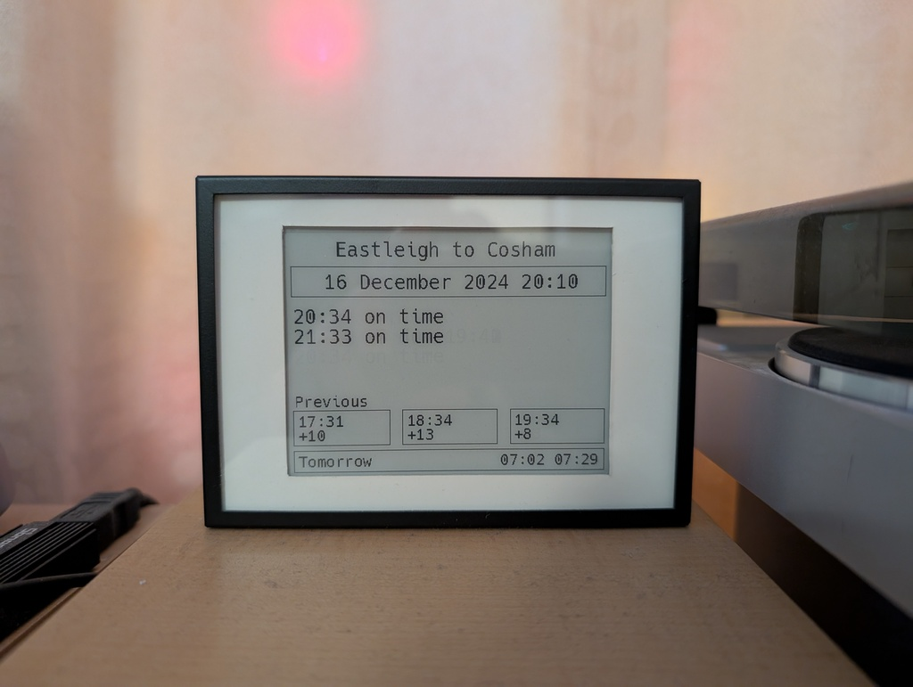

# Train Check

>A project to use a waveshare e-paper (specifically the 4.2 inch model) connected to a Raspberry Pi to display train times in the UK.

The display will show the current date and time updated with the station's names. 

The main section shows current trains that are due into the station and if they're on time or not (for the current hour and next 2 hours). A maximum of the four most recent to arrive trains will be displayed

There are then 3 boxes towards the bottom of the screen to show the three most recent trains that have actually called at the station (and whether they were on time, for the current hour and the previous hour)

Finally a tomorrow box at the bottom for scheduled trains at the hour of your choosing (+- half an hour either direction). As the tomorrow box displays scheduled trains rather than actually departed trains, it helps you to understand if there have been cancellations or strikes for the next day.

The information it displays should enable you to see if there are delays that are affecting all trains or just the one you're interested in. 

## Why

I put this together because I found myself checking the trains before my commute every day by thumbing through the trainline or south western railway app. I thought it would be easier to just quickly glance at a display during my routine in the morning to see if I needed to leave later than planned.

## Configuration

The script that runs and updates the e-ink display is called `screen.py`

The project uses the excellent API available from [realtimetrains.co.uk](realtimetrains.co.uk) which requires an account (which is free) for you to use this project.

The font used on the display is the excellent Hack Nerd Font available from [their website.](https://www.nerdfonts.com/font-downloads)

The libraries to drive the display are taken from the [waveshare github](https://github.com/waveshareteam/e-Paper), specifically from [here](https://github.com/waveshareteam/e-Paper/tree/master/RaspberryPi_JetsonNano/python/lib/waveshare_epd)

There is a traincheck_config.py_example file included in the repository. You should use this to fill in the details containing your realtimetrains api username and password, the to and from stations you want to monitor and the morning hour for the next day.

## Dependencies required

For the best results, use a virtual environment in Python. You can use `python venv -m /path/to/env` to create when /path/to/env is the folder containing the environment you want to create.

Use `pip install` on your raspberry pi for the following:

- waveshare-epaper
- pillow
- gpiozero
- gpiod
- lgpio
- RPi.GPIO
- requests

> It's worth noting that, by default, when a new version of python is installed, the virtual environment will need to have the above installed all over again as the libraries are stored in different subdirectories.

## Running

To use the waveshare e-paper 4.2 inch, run `python screen.py` - it will loop until killed, updating every 5 minutes. 

There's also a `test.py` which outputs results to the terminal for you to play with to get an idea if the API is working.

## Systemd

I've got this setup on my raspberry pi zero 2 w running as a service, in a virtual python environment. The service runs two scripts. One to start, one to stop. I'm not sure if the stop one is technically needed, but it's there anyway. I've listed these below for those interested in using the same route as me. My setup puts everything in /opt/scripts which is just something I've always done. Change to suit.

Scripts to start or stop the python script:

**traincheck-start.sh**
```bash
#!/bin/env bash

source /opt/scripts/virtual-python/bin/activate
cd /opt/scripts/TrainCheck
/opt/scripts/virtual-python/bin/python screen.py
```

**traincheck-stop.sh**
```bash
#!/bin/env bash

pkill -f screen.py
```

**systemd service:**
```
[Unit]
Description=Start TrainCheck to e-paper
After=network.target 

[Service]
User=your_username_here
ExecStart=/opt/scripts/traincheck-start.sh
ExecStop=/opt/scripts/traincheck-stop.sh
Restart=always

[Install]
WantedBy=default.target
```

## Future

- I would like it to be a little more efficient than it is at the moment. For instance, it makes 4 calls every 5 minutes to the API. Some of the data is duplicated and needs to be stripped out. This is a quirk with the API that fetches 30 minutes either side of the hour for the trains that are due to arrive, but also if they actually arrive late. If the time due overlaps into the next hour then a duplication is created. I think an API that could be queried with just the due times would be better.
- I would like to support other displays. I have nothing to test on though. At present it's all hard coded values, but I would like to make that all relative to the display size, including adjusting font sizes. I'm open to contributions if you want to get involved :)
- On that note, maybe an option for a portrait view, as it's currently landscape.
- I would also like to add some fancy pictures of trains or something to it. Some way of making it look less utilitarian.
- Also, to highlight when a rail replacement bus service is in operation (as they're far too common unfortunately).
- Oh, and do some refactoring by moving supporting files into folders or something - this is really my first python project, so I'm not sure of the "etiquette" of such things :)

## Pictures

Here it is running in my house. I've put the display into a little picture frame and hotglued the raspberry pi, housed in a small project box, to the back (as well as hotglued everything else - I love hotglue)...




